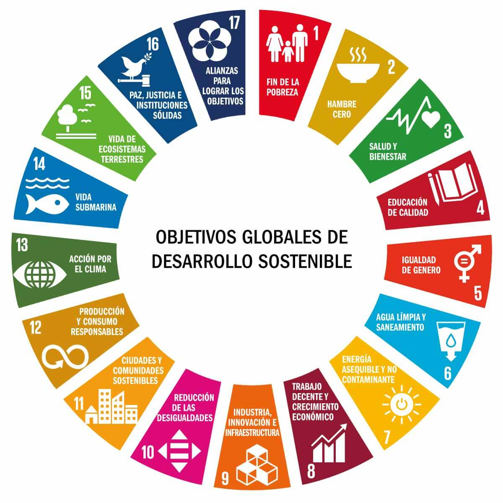

# Presentación del módulo

---

## 1. Información General del Módulo

* **Curso:** 2º DAM-DAW (Desarrollo de aplicaciones Multiplataforma y Web) - Curso 2026-2027
* **Profesor:** José Ángel Segarra ([ja.segarracastillo@edu.gva.es](mailto:ja.segarracastillo@edu.gva.es))
* **Carga horaria:** 34 horas en total (1 hora/semana)
* **Horario:** Viernes de 18:15 a 19:10 h en DAW y 19:10 a 20:05 h en DAM
* **Centro:** IES Severo Ochoa

---

## 2. Resultados de Aprendizaje (RA)

* **RA1:** Identifica los aspectos ambientales, sociales y de gobernanza (ASG) relativos a la sostenibilidad teniendo en cuenta el concepto de desarrollo sostenible y los marcos internacionales que contribuyen a su consecución.
* **RA2:** Caracteriza los retos ambientales y sociales a los que se enfrenta la sociedad, describiendo los impactos sobre las personas y los sectores productivos y proponiendo acciones para minimizarlos.
* **RA3:** Establece la aplicación de criterios de sostenibilidad en el desempeño profesional y personal, identificando los elementos necesarios.
* **RA4:** Propone productos y servicios responsables teniendo en cuenta los principios de la economía circular.
* **RA5:** Realiza actividades sostenibles minimizando el impacto de las mismas en el medio ambiente.
* **RA6:** Analiza un plan de sostenibilidad de una empresa del sector, identificando sus grupos de interés, los aspectos ASG materiales y justificando acciones para su gestión y medición.

---

## 3. Temporalización

El contenido del módulo se organiza en seis unidades didácticas distribuidas a lo largo de dos evaluaciones *(temporalización orientativa)*:

| Unidad Didáctica | Evaluación | Sesiones estimadas |
| :--- | :--- | :---: |
| **UD1:** La sostenibilidad | Primera | 4 |
| **UD2:** Los retos socioambientales actuales | Primera | 4 |
| **UD3:** La sostenibilidad en el desempeño profesional y personal | Primera | 4 |
| **UD4:** Productos y servicios sostenibles | Segunda | 4 |
| **UD5:** Actividades sostenibles | Segunda | 4 |
| **UD6:** El plan de sostenibilidad empresarial | Segunda | 4 |

---

## 4. Criterios de Evaluación

### Ponderación por Resultado de Aprendizaje

Cada resultado de aprendizaje aporta el mismo peso a la nota global *(orientativo)*:

| Resultado de Aprendizaje | Porcentaje |
| :--- | :---: |
| **RA1** | 16,66% |
| **RA2** | 16,66% |
| **RA3** | 16,66% |
| **RA4** | 16,66% |
| **RA5** | 16,66% |
| **RA6** | 16,66% |

!!! warning "Condiciones de Evaluación Continua y Aprobado"
    * **Asistencia:** Aquellos alumnos que no asistan como mínimo al **85% de las horas** (es decir, faltar a más del 15%) perderán el derecho a la evaluación continua y deberán realizar un **examen final de todo el módulo**.
    * **Superación del módulo:** Se deben aprobar **por separado** todos y cada uno de los Resultados de Aprendizaje.

### Instrumentos de Evaluación (por cada RA)
1. **Trabajo en clase y actividades:** Realizadas tanto de manera individual como en grupo.
2. **Pruebas objetivas:** Evaluaciones escritas/prácticas al finalizar cada unidad.

---

## 5. Herramientas Necesarias

Para el desarrollo del curso se emplearán las siguientes plataformas y entornos digitales:

* Correo institucional del estudiante (Outlook).
* Plataforma educativa **Aules**.
* Herramientas del paquete **Microsoft Office**.

---

## 6. Introducción a la Sostenibilidad

### Conceptos Clave

!!! note "Sostenibilidad"
    Es el **mantenimiento a lo largo del tiempo del equilibrio** entre las actividades/sociedades humanas y las condiciones del entorno en el que se desarrollan y que las hacen posibles.

!!! note "Desarrollo Sostenible"
    Aquel capaz de **satisfacer las necesidades de las generaciones actuales sin comprometer la capacidad de las generaciones futuras** para satisfacer sus propias necesidades.

---

### Ejemplos de Sostenibilidad en el Sector IT

En la informática y los sistemas microinformáticos (SMR), la sostenibilidad se aplica mediante:

* **Gestión de RAEE:** Gestión adecuada de Residuos de Aparatos Eléctricos y Electrónicos.
* **Eficiencia energética:** Diseño y despliegue de redes con menor consumo eléctrico.
* **Mantenimiento verde:** Aplicación de buenas prácticas en el mantenimiento de equipos informáticos para alargar su vida útil.

---

### Objetivos de Desarrollo Sostenible (ODS)

Los **ODS** son **17 objetivos globales** adoptados por las Naciones Unidas en 2015 con el propósito de erradicar la pobreza, proteger el planeta y garantizar un futuro sostenible para todas las personas de cara al año 2030.

*Figura 1: ODS adoptados por las Naciones Unidas.*

---

## 7. Dinámica de Calentamiento y Debate

Para reflexionar sobre el impacto tecnológico, abordamos las siguientes cuestiones en parejas:

1. ¿Cuántos dispositivos electrónicos tenéis en casa?
2. ¿Qué pasa con ellos una vez dejan de funcionar?
3. ¿Crees que haces un uso responsable de los dispositivos electrónicos?